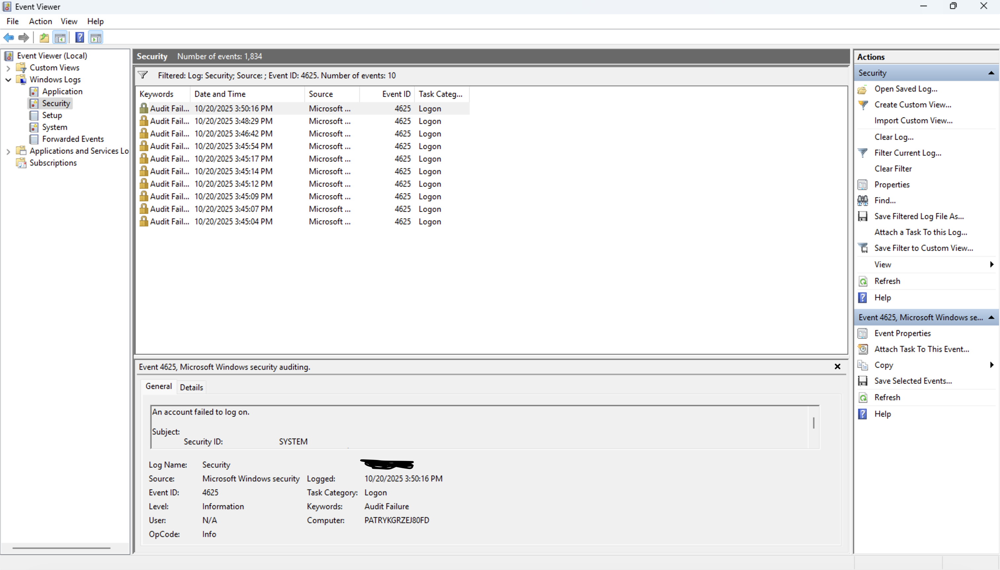

# Incident Report – Phishing Attack Investigation  

## 🧠 Summary  
A simulated phishing email was reported to the SOC.  
The goal of this investigation was to identify malicious indicators, verify the scope of impact, and recommend mitigation steps.  

---

## 📅 Incident Timeline  
| Time (UTC) | Event | Description |
|-------------|--------|-------------|
| 09:45 | Alert generated | Suspicious email reported by user |
| 09:50 | SOC review | Email headers analysed |
| 10:05 | IOC extraction | Malicious URL and IP identified |
| 10:15 | Containment | Blocked URL on proxy & email gateway |
| 10:30 | Recovery | User mailbox cleaned and password reset |

---

## 🔍 Indicators of Compromise (IOCs)  
| Type | Value | Description |
|------|--------|-------------|
| URL | `http://login-secure.microsoft.support/reset` | Credential phishing link |
| IP | `203.0.113.55` | Associated with previous phishing campaigns |
| SHA256 | `0a1b2c3d4e5f...` | Malicious attachment hash |

---

## 🧩 Analysis & Evidence  
- **Header Analysis:**  
  - `Return-Path` domain mismatch.  
  - SPF & DKIM failed.  
- **Email body:** HTML form asking for credentials.  
- **Wireshark:** DNS query for malicious domain observed.  
- **CyberChef:** Decoded obfuscated HTML contained fake login redirect.

*(Screenshots can be added here later in `/images`.)*

---

## 🧰 Tools Used  
- Microsoft Sentinel  
- Splunk (email logs correlation)  
- CyberChef  
- Wireshark  
- VirusTotal  

---

## 🛠 MITRE ATT&CK Mapping  
- T1566.002 – Phishing: Spearphishing Link  
- T1071.001 – Application Layer Protocol: Web Traffic  

---

## 🚑 Containment, Eradication & Recovery  
- Blocked the domain on email gateway and proxy.  
- Reset affected user credentials.  
- Verified no lateral movement via Sentinel query.

---

## 📘 Lessons Learned  
- Implement stricter SPF/DKIM policies.  
- Educate users on email verification procedures.  
- Automate phishing triage using playbooks in Sentinel.
